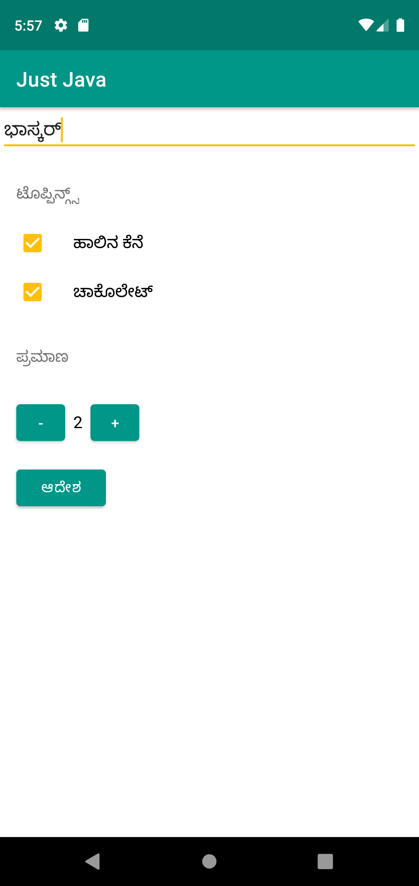

# JustJavaApp

Project built based on learnings from the course [ud836](https://classroom.udacity.com/courses/ud836).

## Things learnt

1. Fetching user input using [`EditText`](https://developer.android.com/reference/android/widget/EditText) view.
1. Fetching checked state of [`CheckBox`](https://developer.android.com/guide/topics/ui/controls/checkbox)es.
1. Localization concept; Adding `Kannada` language support to the app.
1. Using [`Button`](https://developer.android.com/reference/android/widget/Button)s.
1. Creating [`Intent`](https://developer.android.com/guide/components/intents-common#Email) to send the order summary to the e-mail app.
1. Styling the texts and setting the theme colors.

## Screen shot of the Application

## References
1. Starting point to learning about anything about Android - [Android Developer site](https://developer.android.com/)
1. Generating colors for your theme - [Material Palette](https://www.materialpalette.com/)
